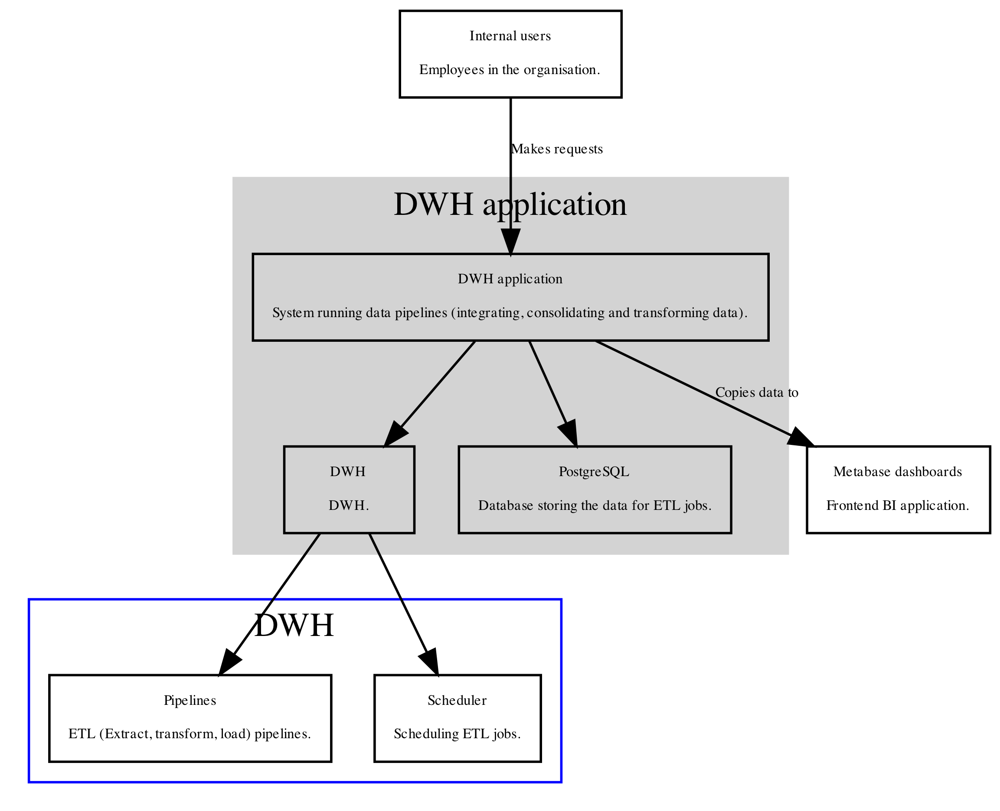

<!-- TABLE OF CONTENTS -->
## Table of Contents

- [Introduction](#introduction)
- [Architecture](#architecture)
- [Requirements](#requirements)
- [Installation](#installation)
- [Configuration](#configuration)
- [How to start](#how-to-start)
- [Usage](#usage)
  * [Running prediction service locally](#running-prediction-service-locally)
  * [Training model](#training-model)
  * [Other usages](#other-usages)


<!-- INTRODUCTION -->
## Introduction

Lorem ipsum dolor sit amet, consectetur adipiscing elit. :

-
-
- 

## Architecture



<!-- REQUIREMENTS -->
## Requirements

- Lorem ipsum dolor sit amet, consectetur adipiscing elit.
- Praesent suscipit dolor congue justo feugiat, et consectetur nulla varius.
- Phasellus a libero sagittis, imperdiet felis ac, imperdiet justo.

<!-- INSTALLATION -->
## Installation


* Lorem ipsum dolor sit amet, consectetur adipiscing elit.

```
cmd
```

* Praesent suscipit dolor congue justo feugiat, et consectetur nulla varius.

```
cmd
```

<!-- CONFIGURATION -->
## Configuration

```
cmd
```

Configurable parameters:

*
*
*

<!-- HOW TO START -->
## How to start

To start the service, use:

```
cmd
```

Stopping the service with:

```
cmd
```

If the service crashes, 

```
cmd
```


<!-- USAGE EXAMPLES -->
## Usage

### Running prediction service locally

* Sed blandit tortor eu eleifend facilisis.

```
cmd
```

* Proin tristique arcu non rutrum dapibus.

```
cmd
```


### Training model

* Proin pretium nunc lobortis volutpat sagittis.

```
cmd
```

* Aenean et nisi sed massa pellentesque tristique.

```
cmd
```

### Other usages

Lorem ipsum dolor sit amet, consectetur adipiscing elit. Curabitur et facilisis tellus, et pretium nibh. Vivamus condimentum mauris nec lacus gravida, quis feugiat augue consequat. Aenean nec libero et risus facilisis blandit id nec arcu. Donec eget augue quam. Proin ullamcorper sodales lectus et consectetur. Nulla non nunc elit. In condimentum suscipit volutpat. Praesent non ullamcorper lectus. Nulla non varius lorem, elementum pulvinar mi. Duis at mi elementum, ultricies tortor quis, elementum mauris.


